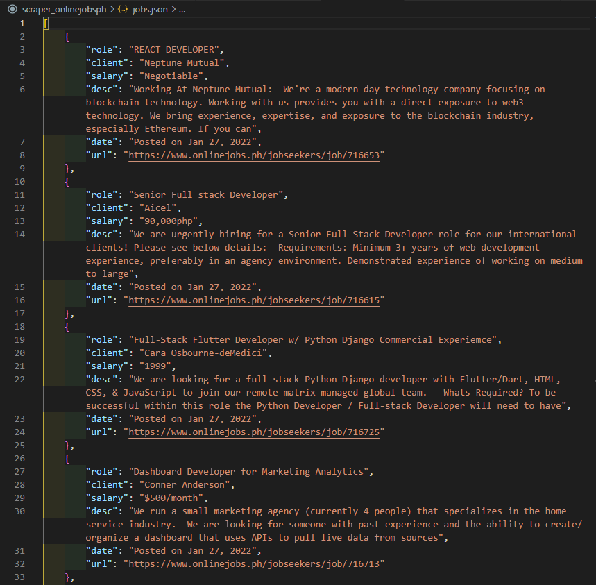

# OnlineJobsPH Job Posts Scraper

If you want to keep tabs of available job posts on the [OnlineJobsPH JobSearch](https://www.onlinejobs.ph/jobseekers/jobsearch) platform based on specific keywords, without spending a lot of time scrolling through many pages, this scraper can help.

---

## What You Need

* [Scrapy](https://github.com/scrapy/scrapy). Install this on your machine.

---

### Scrape Job Posts for Today

1. Open a web browser. Go to the remote code repository (<https://github.com/jasonogayon/scraper-onlinejobsph>) and copy its SSH or HTTPS link.

2. On your machine, open a terminal and clone the remote repository locally wherever you want. Run `git clone git@github.com:jasonogayon/scraper-onlinejobsph.git`.

3. After that, go inside the cloned **scraper-onlinejobsph** repository. You can decide to rename this directory to what you want.

4. Now, assuming you have Scrapy successfully installed on your machine, we can start using our scraper. Run `make s`. This retrieved the available job posts for today for the keywords that the scraper is set to watch for. A `jobs.json` file would be generated after.

---

### Scrape Job Posts for Yesterday

1. If you want to look at available job posts yesterday for the keywords that the scraper is set to watch for, run `make y`.

---

### Scraped Data: jobs.json

Running the scraper generates a `jobs.json` file with job posts data matching the keywords that was search for. On each run, it deletes the file (if it exists) and generates a new one.

Here's what a sample file looks like after opening it and formatting it a bit with the use of a text editor:

---

Author: Jason B. Ogayon \
Software Engineer and Software Tester
